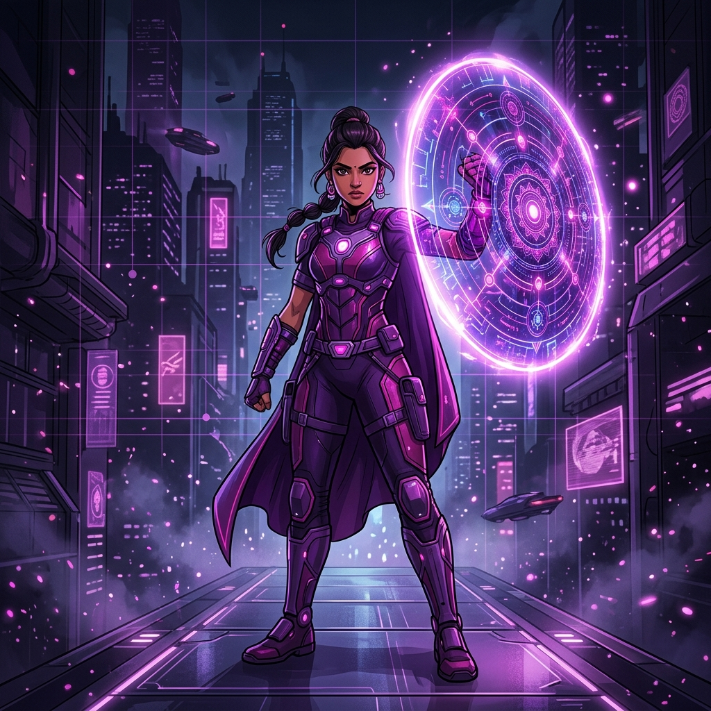

# 🛡️ SHIELD — Women's Safety App

**"Because safety should not wait."**



---

## 🚨 What is SHIELD?

SHIELD is a **real-time women's safety application** that provides:

✅ **Shake-to-Trigger SOS** — No buttons, no unlock needed  
✅ **Real SMS Alerts** — Works without internet (2G compatible)  
✅ **Live GPS Tracking** — Real-time location sharing  
✅ **Auto Evidence Recording** — Audio/video capture during emergencies  
✅ **110dB Loud Alarm** — Works even on silent mode  
✅ **AI Safety Assistant** — 24/7 guidance and support  

---

## 🎯 Features

### Core Safety Features (FREE)
- **Instant SOS Trigger** via shake, voice command, or button
- **2 Trusted Contacts** with SMS alerts
- **Offline SMS System** — works without internet
- **GPS Location Sharing** — updates every 30 seconds
- **Emergency Numbers** — One-tap access to 112, 100, 1091
- **Loud Alarm System** — 110 decibels

### Premium Features
- **5 Trusted Contacts**
- **Auto Evidence Recording** — audio & video
- **Live GPS** — 10-second updates
- **Cloud Storage** for evidence
- **Route Safety Check**
- **Full AI Assistant**

### Family Plan
- **5 Family Members**
- **10 Contacts per member**
- **Family Safety Dashboard**
- **Group SOS Alerts**
- **Priority Support**

---

## 🚀 Quick Start

### Local Development

```bash
# Clone the repository
git clone https://github.com/yourusername/shield.git
cd shield

# Start the server
start.bat

# Or manually:
cd backend
npm install
npm start
```

**Server runs at:** `http://localhost:3000`

---

## 📁 Project Structure

```
SHIELD/
├── backend/              # Node.js + Express API
│   ├── routes/          # API endpoints (12 modules)
│   ├── services/        # Business logic (5 services)
│   ├── middleware/      # Auth & validation
│   ├── utils/           # Database & SMS helpers
│   ├── data/            # JSON file database
│   └── server.js        # Main server file
│
├── frontend/            # Static HTML/CSS/JS
│   ├── js/             # Auth & app logic
│   ├── css/            # Styles & modals
│   ├── assets/         # Images & media
│   └── index.html      # Main page
│
├── start.bat           # Windows startup script
├── vercel.json         # Vercel deployment config
└── README.md           # This file
```

---

## 🌐 Deployment

### Deploy to Vercel (2 minutes)

```bash
npm install -g vercel
vercel login
vercel
vercel --prod
```

### Deploy to Render

1. Go to https://render.com
2. New Web Service → Connect GitHub
3. Build: `cd backend && npm install`
4. Start: `cd backend && npm start`
5. Add environment variables

### Deploy to Railway

1. Go to https://railway.app
2. New Project → Deploy from GitHub
3. Add environment variables
4. Auto-deploys

**See [DEPLOYMENT_GUIDE.md](DEPLOYMENT_GUIDE.md) for detailed instructions.**

---

## 🔧 Configuration

### Environment Variables

Create `backend/.env`:

```env
PORT=3000
NODE_ENV=development
JWT_SECRET=your-secret-key-here
SMS_PROVIDER=demo
DB_TYPE=json_file
CORS_ORIGINS=http://localhost:3000
```

### Production Settings

Update `frontend/js/auth.js`:

```javascript
const API_BASE_URL = 'https://your-backend-url.com/api';
```

---

## 📡 API Endpoints

### Authentication
- `POST /api/auth/register` — Create account
- `POST /api/auth/login` — Login
- `GET /api/auth/me` — Get current user
- `POST /api/auth/upgrade` — Upgrade plan

### SOS & Emergency
- `POST /api/sos/trigger` — Trigger SOS alert
- `POST /api/sos/safe` — Mark as safe
- `GET /api/sos/history` — Get SOS history
- `GET /api/emergency` — Get helpline numbers

### Contacts & Location
- `GET /api/contacts` — Get trusted contacts
- `POST /api/contacts` — Add contact
- `POST /api/location/update` — Update GPS
- `GET /api/location/latest` — Get latest location

### AI Assistant
- `POST /api/ai/chat` — Chat with SHIELD AI
- `GET /api/ai/safety-tips` — Get safety tips

**Total: 57 API endpoints**

See [BACKEND_STATUS.md](BACKEND_STATUS.md) for complete API documentation.

---

## 🛡️ How SHIELD Works

### 1. Shake Trigger
- User shakes phone 3 times rapidly
- Accelerometer detects motion
- SOS fires in under 2 seconds
- No screen unlock needed

### 2. SMS Alert System
- Real SMS sent via cellular network
- Works without internet (2G compatible)
- Contains name, GPS, Google Maps link
- Contacts receive on any phone

### 3. Emergency Response
- SMS sent to all contacts
- Live GPS tracking starts
- Audio/video recording begins
- 110dB alarm activates
- Auto re-alert every 10 minutes

---

## 👥 Team

Built by:
- **Sobhana Kumari** — Founder & Frontend Developer
- **Sanskriti Tyagi** — Product Manager
- **Vaidehi Gupta** — Co-Founder & Operations Manager
- **Jay Tyagi** — Marketing & Business Development Head

**Contact:** kumarisobhana119@gmail.com

---

## 📞 Emergency Numbers (India)

- **112** — All emergencies
- **100** — Police
- **1091** — Women helpline (national)
- **181** — Women helpline (state)
- **102** — Ambulance
- **1098** — Child helpline
- **1930** — Cyber crime

---

## 🔒 Security

- **JWT Authentication** — 30-day token expiry
- **Bcrypt Password Hashing** — 10 salt rounds
- **CORS Protection** — Whitelisted origins only
- **End-to-End Encryption** — Location data encrypted
- **No Third-Party Sharing** — Your data stays private

---

## 📄 License

ISC License — Free to use for safety purposes.

---

## 🆘 Support

**Email:** kumarisobhana119@gmail.com  
**Emergency:** Call 112  
**Women Helpline:** 1091  

---

## ⭐ Star This Project

If SHIELD helps you feel safer, please star this repository!

---

🛡️ **SHIELD is real. Safety is real. You are protected.**
